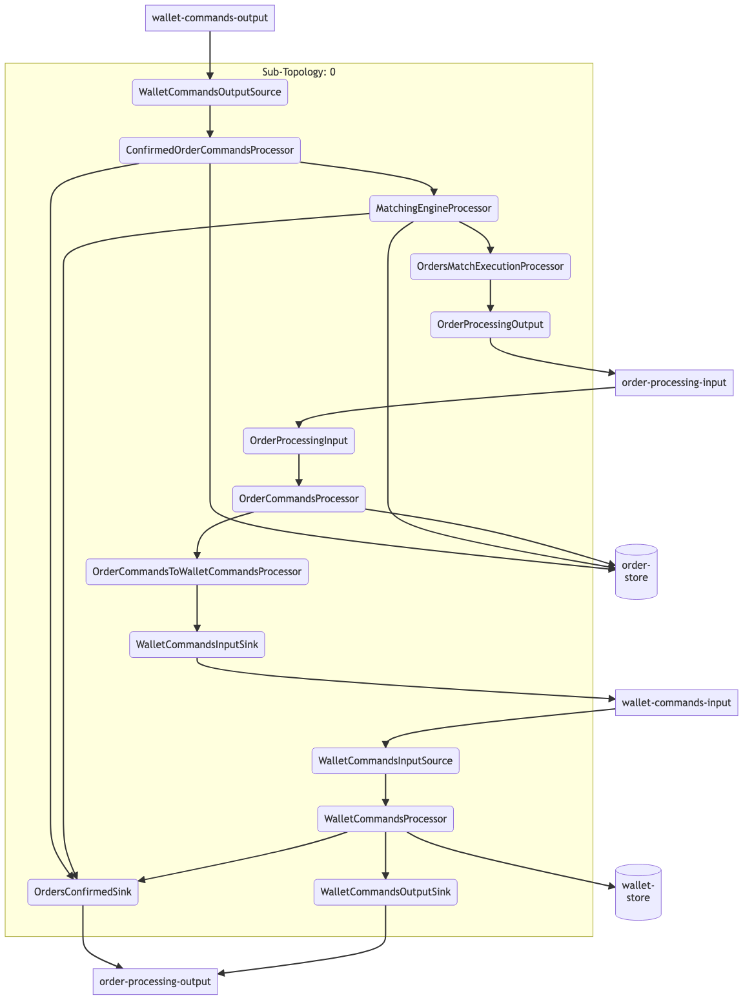

# CRYPTON Cryptocurrency Exchange
This cryptocurrency exchange is built entirely on top of Apache Kafka, utilizing Kafka Streams for building order processing pipelines and Kafka SQL (KSQL) for real-time data processing and query capabilities.

## Project purpose

#### Achieve [ACID  transaction properties with Kafka Streams](https://www.youtube.com/watch?v=v2RJQELoM6Y) application
Cryptocurrency exchange domain sets high requirements for availability, performance and consistency of the operations:
on one hand, we can expect high volume of orders, on other hand - each order's processing is an operation where ACID propertis are critical:
1. <b>Atomicity</b> - either all operations related to order execution is persisted or none at all 
2. <b>Consistency</b> - when two orders matched, all the related operations - order's removal from order book, credit and debit operations on both wallets involved - should be executed together, or none at all
3. <b>Isolation</b> - each order execution process should be isolated from other similar ones enough to ensure data it uses relevant till the end of the execution  
4. <b>Durability</b> - if order processing is successful, the changes to the data persisted even if there are system failures
[Also check out this on Kafka as DB topic](https://www.kai-waehner.de/blog/2020/03/12/can-apache-kafka-replace-database-acid-storage-transactions-sql-nosql-data-lake/) 

#### Kappa architecture showcase
[Kappa architecture, unlike Lambda](https://www.kai-waehner.de/blog/2021/09/23/real-time-kappa-architecture-mainstream-replacing-batch-lambda/), assumes we use single pipeline/tools to process both bounded (batch) and unbounded (real-time) data.
This architecture pattern that emphasizes the use of real-time data streams and a unified log as the foundation for all data systems.
The idea is real-time data can be always converted to static one (for example, we can build a snapshot of user balances from wallet updates stream), 
but it's not always work the other way (batch -> realtime is hard).

#### Development experience evaluation
Monitoring, debugging, testing and modification of stream-based solutions definitely more complex comparing to traditional-database-based solutions. 
Let's see how the development experience for the complex streaming application looks like. 

## Scope
1. Orders operations (submit, fill, cancel)
2. Order matching
3. Wallet operations (debit, credit, order-specific operations like blocking funds for orders and unblocking on execution/cancellation)

### Streams topology

4. REST API for order and wallet operations, and also for getting current state of order/wallet, including:

    4.1 Pull API (request-response calls)
   
    4.2 Push API (real-time updates based on SSE - server-sent event - calls)
5. Load testing
6. Monitoring

## Out of scope (for now)
1. Deposit/withdrawal of crypto assets
2. Fiat currencies operation
3. Security, including Authentication and Authorization
4. Compliance (KYC, AML)
5. Cloud (deployment) architecture of the solution

## Pre-requisites
1. Docker

## License
This project is licensed under the MIT License - see the LICENSE.md file for details.
